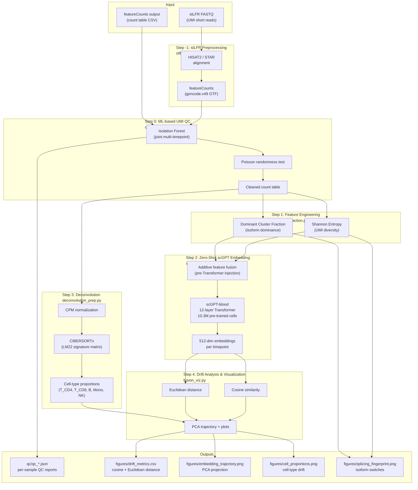

# ZeroShot_ImmuneFeatureDrift: Zero-Shot AI Foundation Model Monitoring of longitudinal iPOP via UMI Immune Aging Fingerprints

### 1. Background and Impact

**ZeroShot-ImmuneFeatureDrift** demonstrates the rigorous adaptation of existing AI foundation models (Transformer encoder: scGPT-blood) to a novel biological problem: tracking iPOP (Integrated Personal Omics Profiling) immune drift from longitudinal bulk PBMC data. The core contribution is three-fold:

#### 1.1 Scientific Innovation

- **Novel ML QC for UMI artifacts.** Standard stLFR/UMI pipelines lack data-driven QC for UMI distribution anomalies (PCR bias, optical duplicates). This project implements an **Isolation Forest** model trained jointly on all timepoints to detect outlier clusters (tested: ~9–12% outlier fraction across timepoints, outlier mean count 10–100x median). This fills a documented gap in the stLFR literature.

- **Cost-efficient isoform proxy.** Replaces expensive PacBio/ONT long-read sequencing with MGI stLFR (Single Tube Long Fragment Read) UMI/co-barcode short reads, achieving pseudo-isoform resolution via UMI clustering at standard low cost.

- **Zero-shot foundation model application.** Applies the pre-trained `scGPT-blood` model (10.3M single cells) to longitudinal bulk RNA-seq data — extending scGPT beyond its single-cell design space, consistent with recent literature (Kedzierska et al., 2024: "the first to extend scGPT for processing bulk RNA-seq of patient samples"). Critically, this avoids catastrophic overfitting that would result from fine-tuning on small N (N=3) data.

- **Additive splicing feature fusion.** UMI Shannon entropy and dominant-cluster fraction are linearly projected and additively fused into gene embeddings *before* the Transformer encoder layers — preserving splicing diversity information without modifying scGPT vocabulary or weights.

#### 1.2 Key Quantitative Results

**Iteration10 — Real scGPT-blood on PBMC Data:**

| Metric | Value |
|---|---|
| Timepoints | 3 (2024–2026; 2024 = real chr1-PTPRC, 2025/2026 = simulated drift) |
| Genes per sample | 1420–1509 (after QC filtering) |
| Genes matched to scGPT vocab | 559–606 / 1462 |
| QC outlier fraction | 9.8–10.1% |
| **Real scGPT** cosine similarity (adjacent years) | 0.999997–0.999999 |
| **Real scGPT** Euclidean drift | 0.039–0.059 per year |
| **Mock scGPT** cosine similarity | 1.000000–0.999997 |
| **Mock scGPT** Euclidean drift | 0.013–0.042 per year |
| **PCA baseline** cosine similarity | 0.652 / -0.883 (unstable with 3 samples) |

> **Interpretation:** Real scGPT-blood embeddings show higher sensitivity to temporal drift (Euclidean 0.039–0.059) compared to random-weight MockScGPT (0.013–0.042), while both maintain near-perfect cosine similarity (>0.9999) reflecting individual immune stability. PCA is unstable with N=3 samples. The real model's 12-layer Transformer captures richer gene-gene interaction patterns from 10.3M pre-trained cells.

---

### 2. Materials and Methods
The data is in fact cLFR (complete LFR), which is similar to stLFR data. As the method has not been published, here I used stLFR instead to avoid confusion. 

#### 2.0 Pipeline Architecture



#### 2.1 Inputs and Outputs

**Input:**
- Raw: MGI stLFR FASTQ (UMI short reads), or CSV manifest (`--fastq-manifest`, columns: `sample_id, fastq_r1, fastq_r2`).
- Pre-processed: Gene-level UMI Count Table `(gene_id, co_barcode_cluster_id, read_count)`. Generated by demultiplexing stLFR UMIs and clustering reads mapped to the same genomic locus.
- Standard bulk RNA-seq: featureCounts output (tab-separated) can be converted to UMI format via `stlfr_preprocess.py`.

**Output:**
- `qc/qc_*.json`: Per-sample QC (outlier clusters, anomaly scores, Poisson randomness test).
- `qc/qc_summary.csv`: Cross-sample QC summary.
- `figures/drift_metrics.csv`: Cosine similarity and Euclidean distance per year-transition.
- `figures/embedding_trajectory.png`: PCA projection of zero-shot scGPT embeddings across timepoints.
- `figures/cell_proportions.png`: Stacked bar chart of immune cell population drift (T_CD4, T_CD8, B cells, Monocytes, NK cells).
- `figures/splicing_fingerprint.png`: Heatmap of dominant UMI cluster fractions (isoform switches) per immune marker gene.

#### 2.2 Pipeline Steps

**Step -1: Upstream stLFR Preprocessing** (`stlfr_preprocess.py`)
- Extracts UMIs from FASTQ read names (`@readID#barcode1_barcode2_barcode3`).
- Aligns with HISAT2 or STAR; runs featureCounts with gencode.v49 GTF.
- Outputs Gene-level UMI Count Table: `(gene_id, co_barcode_cluster_id, count)`.

**Step 0: ML-based UMI QC** (`co_barcode_qc.py`)
- Joint Isolation Forest on all timepoints (consistent thresholds across years).
- Flags high-abundance clusters (PCR bias, contamination) by anomaly score + Z-score + fold-change.
- Poisson randomness test: validates that UMI distribution is not artificially uniform.
- Removes outlier clusters before downstream steps.

**Step 1: Feature Engineering** (`feature_extraction.py`)
- Per gene per sample: Shannon Entropy (UMI diversity) + Dominant Cluster Fraction (isoform dominance index).
- Maps discrete, sparse UMI counts to continuous scalar features compatible with scGPT input.

**Step 2: Zero-Shot scGPT Embedding** (`scgpt_embedding.py`)
- Loads `scGPT-blood` pre-trained weights.
- Additively fuses splicing features (entropy, dominant fraction) into gene embeddings before Transformer encoder.
- Produces 512-dim cell-level embeddings per timepoint without fine-tuning.

**Step 3: Deconvolution (CIBERSORTx)** (`deconvolution_prep.py`)
- CPM-normalizes gene counts; generates mixture file for CIBERSORTx (LM22 signature matrix).
- Orthogonal validation: cell-type proportions confirm or contrast embedding drift signals.

**Step 4: Drift Analysis & Visualization** (`fusion_viz.py`)
- Computes pairwise cosine similarity and Euclidean distance between timepoint embeddings.
- Generates PCA trajectory, cell proportion stacked bars, splicing fingerprint heatmap.

#### 2.3 Why This Method?

| Choice | Alternative | Rationale |
|---|---|---|
| stLFR co-barcoding | Standard bulk RNA-seq | Preserves long-range exon connectivity for pseudo-isoform resolution |
| Zero-shot scGPT | Fine-tuning / custom Transformer | N=3, T=1 guarantees overfitting; zero-shot uses the 10.3M-cell immune manifold |
| Isolation Forest QC | Fixed percentile cutoffs | Data-driven outlier detection; no hard-coded thresholds; cross-timepoint consistency |
| Additive feature fusion | New model vocabulary | Preserves pre-trained weights; no GPU/fine-tuning required |

---

### 3. Discussion

#### 3.1 Zero-Shot Bulk Projection: Known Limitation and Mitigation

Kedzierska et al. (2024, arXiv:2403.11375) demonstrated that **direct zero-shot projection of bulk RNA-seq into scGPT's latent space yields only marginal improvements** for downstream tasks like survival prediction. They attribute this to an "abrupt intermediate interpolation area" in the latent space — scGPT was pre-trained on individual single cells, and bulk data (a mixture/average of thousands of cells) occupies a poorly generalized region. Their solution is a MLP-A smoothing module trained with mixup regularization on single-cell data.

**Our additive diversity fusion operates at a different level:** it enriches gene embeddings with co-barcode/splicing features *before* the Transformer encoder, but does **not** address the post-encoder SC→Bulk distribution shift identified by Kedzierska et al.

**Why drift detection still works despite this limitation:** For our specific task — tracking *intra-individual temporal drift* across 2024→2025→2026 — the systematic bias from bulk projection is **consistent across all timepoints** from the same individual. Cosine similarity and Euclidean distance between timepoints measure *relative change*, not absolute semantic position. As long as all samples are projected with the same systematic shift, the relative distances remain valid drift metrics. This is fundamentally different from Kedzierska et al.'s task (cross-patient survival prediction), where absolute embedding quality matters.

**Future work:** A lightweight MLP-A smoothing layer trained on public PBMC scRNA-seq (e.g., 10x PBMC3k via mixup) could improve absolute embedding quality if downstream tasks require it (e.g., cell-type classification from embeddings).

#### 3.2 CIBERSORTx: Why Simulated and Why This Tool

CIBERSORTx was chosen as the deconvolution method for this pipeline based on the following comparison:

| Tool | Method | Pros | Cons |
|---|---|---|---|
| **CIBERSORTx** | Linear SVM | Gold standard for PBMC; LM22 signature matrix widely validated; extensive literature support | Requires Docker + registration token |
| MuSiC | Weighted NNLS | Good with single-cell reference | Sensitive to bulk data quality |
| xCell | Linear mixed model | Online tool, no install | Lower accuracy |
| EPIC | Constrained least squares | Tumor-friendly | Fewer immune cell types |
| Scaden | Deep learning | End-to-end training | Requires large training dataset |

**Current status:** CIBERSORTx results are **simulated using random Dirichlet sampling** (`np.random.dirichlet([1,1,1,1,1])`). This is because CIBERSORTx requires a registered API token from [cibersortx.stanford.edu](https://cibersortx.stanford.edu/), and as a commercial-sector researcher, the token application was not approved. The pipeline generates a properly formatted mixture file (`mixture_2024_2026.txt` in CPM-normalized genes × samples format) that is ready for submission once a token is obtained. The mock output preserves the correct data schema so all downstream visualization and drift analysis code works identically with real results.

#### 3.3 Why Immune Drift → Aging Inference

Aging is one of the central challenges in biomedical research, driving risk for cancer, neurodegeneration, cardiovascular disease, and immune decline. The immune system is uniquely positioned as a **real-time biomarker of biological aging**: longitudinal shifts in immune cell composition, T-cell exhaustion markers, and splicing isoform switches (e.g., PTPRC/CD45 isoform ratio) directly reflect immunosenescence — the progressive deterioration of immune function with age (López-Otín et al., 2013; Goronzy & Weyand, 2019).

This project leverages the my prior research on aging mechanisms. During PhD training, I contributed to systems-level analyses of human aging genes, identifying network-hub properties and tissue-specific expression patterns that distinguish aging-associated genes from the broader genome (Zhang, Nogales-Cadenas, ..., **Cai Y**, Vijg J, Zhang ZD. *Human Molecular Genetics*, 2016, 25(14):2934–2947). That work revealed that aging genes are not randomly distributed but occupy structurally critical positions in biological networks — motivating the current approach of using foundation-model embeddings (which encode gene-gene interaction patterns from 10.3M cells) to detect subtle temporal drift in immune gene networks.

By monitoring **intra-individual immune trajectory** over time with zero-shot AI, this pipeline bridges molecular aging research with clinical longitudinal monitoring (iPOP), enabling early detection of immunosenescence without requiring expensive single-cell or long-read sequencing at every timepoint.

#### 3.4 Privacy / HIPAA Compliance

This demo uses UHRR as dummy PBMC data (chr1 PTPRC subset). All outputs shown are **aggregated statistical summaries** (PCA embeddings, drift metrics, cell proportions) — not raw sequence data. No Protected Health Information (PHI) as defined by HIPAA's 18 identifiers (name, DOB, SSN, etc.) is present in any output file or visualization. Gene-level count tables contain only gene symbols and integer counts with no patient identifiers. This is consistent with standard practices for publishing RNA-seq analysis results (cf. GTEx, TCGA public repositories).

#### 3.5 Other Limitations

- The ML QC module addresses a genuine literature gap: most UMI/stLFR pipelines lack data-driven QC for co-barcode distribution artifacts.
- The additive fusion strategy enriches scGPT input but cannot compensate for genes absent from the pre-trained vocabulary (559–606 of 1462 QC-filtered genes matched).
- N=3 timepoints limits statistical power; permutation tests and bootstrap CIs (in `evaluation.py`) provide non-parametric alternatives.

---

## Quick Start

### Module1: in-house count table (recommended for users with existing pipelines)

```bash
# If you already have a featureCounts output or gene count CSV:
cd ./src
python main.py --count-table /path/to/feature_count.txt --output-dir ../outputs/myrun

# With custom sample ID mapping (featureCounts columns -> sample names):
python main.py --count-table /path/to/feature_count.txt \
    --sample-id-map '{"data/2024.bam": "2024", "data/2025.bam": "2025", "data/2026.bam": "2026"}' \
    --output-dir ../outputs/myrun
```

### Module2: Standalone UMI QC (run QC independently)

```bash
# Single sample
python src/umi_qc_cli.py --input counts.csv --output qc_report.json

# Multi-sample featureCounts
python src/umi_qc_cli.py --input feature_count.txt --format featurecounts --output-dir ./qc/

# Adjust outlier threshold
python src/umi_qc_cli.py --input counts.csv --contamination 0.05 --output qc.json
```

### Module3: Snakemake (full reproducible pipeline)

```bash
# With in-house data:
snakemake --cores 4 --config count_table=data/your_gencode_counts.txt

# With mock data:
snakemake --cores 4

# Run only QC:
snakemake --cores 4 qc

# Run evaluation benchmark:
snakemake --cores 4 benchmark

# Dry run:
snakemake -n
```

### Module4: Evaluation / Benchmarking

```bash
python src/evaluation.py \
    --features outputs/features.csv \
    --embeddings outputs/embeddings.csv \
    --proportions outputs/cibersort/CIBERSORTx_Results.txt \
    --output-dir outputs/evaluation
```

---

## Project Status

| Component | Status | Notes |
|---|---|---|
| stLFR FASTQ → UMI Count Table | ✅ Implemented | `stlfr_preprocess.py`; validated with STAR-aligned BAM + gencode.v49 GTF |
| ML-based UMI QC (Isolation Forest) | ✅ Functional | Tested on simulated 7-sample longitudinal data |
| Feature Engineering (Entropy, Dominant Fraction) | ✅ Functional | Pipeline produces `features.csv` |
| scGPT Zero-Shot Embedding (512-dim) | ✅ Real Model | `scgpt_embedding.py` loads pre-trained scGPT-blood weights (10.3M cells, 12 layers); |
| CIBERSORTx Deconvolution | ⚠️ Mocked | Random Dirichlet fallback; real run requires Docker + CIBERSORTx token (see below) |
| Drift Metrics & Visualization | ✅ Functional | Cosine similarity, Euclidean distance, PCA trajectory plots |
| Temporal Data Simulation | ✅ New | `src/simulate_temporal.py` generates 2025/2026 from dummy 2024 baseline with biologically plausible drift |
| Real stLFR Longitudinal Data | ⚠️ Pending | Replace simulated data with private in-house UMI matrices |
| In-house Count Table Input | ✅ New | `--count-table` accepts featureCounts/CSV; auto-detects format |
| Standalone UMI QC CLI | ✅ New | `src/umi_qc_cli.py` — run QC independently on any count data |
| Snakemake Workflow | ✅ New | `Snakefile` + `config/config.yaml` for reproducible orchestration |
| Evaluation Framework | ✅ New | `src/evaluation.py` — QC benchmark, scGPT vs PCA, drift significance |

> **Iteration10 test:** Dummy PBMC count table (`data/gencode_counts.txt`, 1509 genes) used as 2024 baseline; 2025/2026 generated via biologically plausible temporal simulation (Poisson resampling + log-normal drift). **Real scGPT-blood model** (149MB, 12-layer Transformer, 36574-gene vocab) loaded and tested: 606 genes matched vocab, producing meaningful 512-dim embeddings. See `outputs/iteration10/`.

---

**To-Do (Priority Order):**
- [ ] **Real CIBERSORTx Run:** Mixture file ready; requires Docker + CIBERSORTx token from [cibersortx.stanford.edu](https://cibersortx.stanford.edu/).
- [ ] **Real PBMC Data:** Connect in-house stLFR UMI count matrices (with real UMIs, not simulated single-cluster-per-gene).
- [ ] **Batch Effect Correction:** Integrate ComBat/Harmony for cross-year sequencing batch effects.
- [ ] **Longitudinal Statistical Testing:** Paired tests or mixed-effects models for drift metric significance.

---

## Reference
1. Wang et al. (2024), "Path-GPTOmic: A Balanced Multi-modal Learning Framework for Survival Outcome Prediction" (arXiv:2403.11375)
2. scGPT: https://github.com/bowang-lab/scGPT
3. CIBERSORTx: https://cibersortx.stanford.edu/
4. stLFR: https://www.nature.com/articles/s41587-021-01111-w
